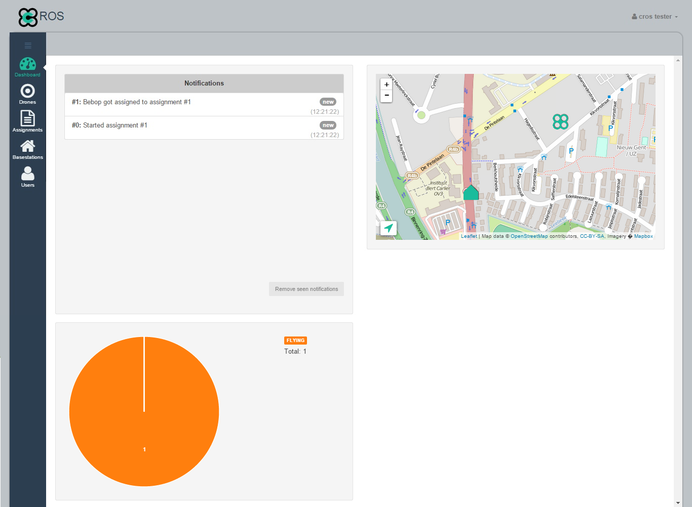
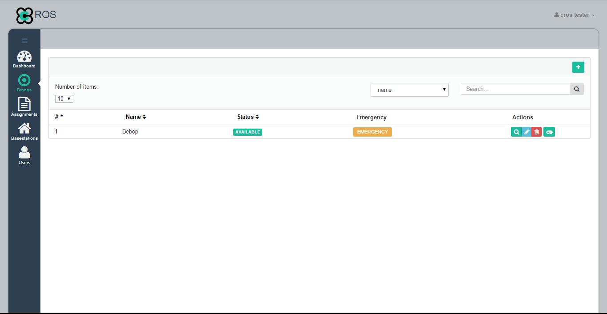
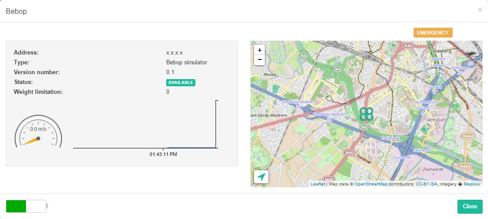
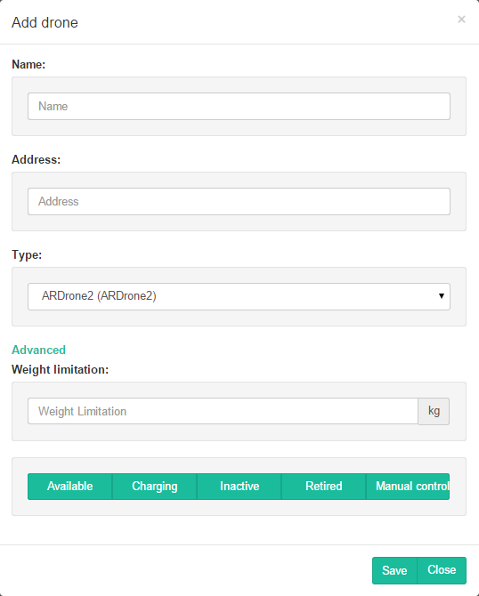
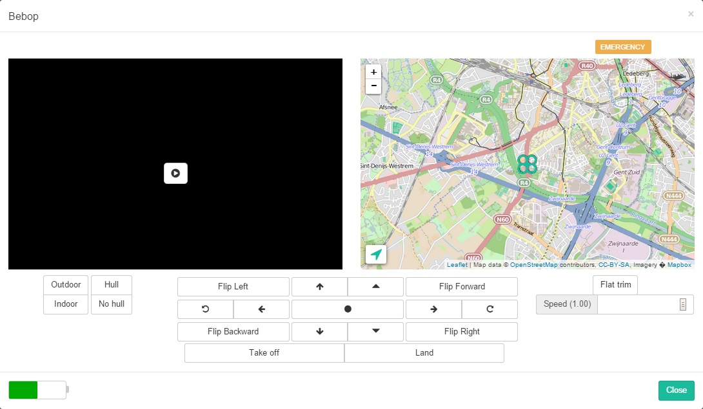
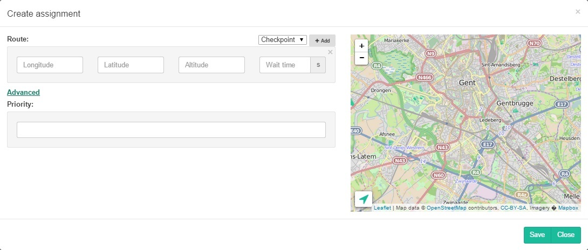

Administrator application usage
===============================

General
---------

The administrator application is built upon the REST API. The aim of this application is to help administrators in monitoring and maintaining the system using visual feedback. Hence, the usage of it is not obligated: it is possible to create a custom managing application via the REST API.

It is up to the end user to decide whomever is authorized to use this application upon usage and at which authorization level. Note however that the "ADMINISTRATOR" authorisation level is the least restricted: the user will be able to access all information and affect the complete system.

Following sections will include screenshots of the application with extra information about the functionality and usage of the application.

Accessing the Application and Security Restrictions
--------------------------------

In order to use the application, the user is obligated to log in using the credentials provided by the administrator. Logging into the application will cause the system to respond with an authorization token determining the authorisation level of the user and restricting it's actions on the system content. This token is required to further address the system and execute actions. However, it is the task of the application to keep track of the authorisation token: the usage of the token is completely transparent to the user.

The system defined three authorisation levels as given in the following table. The table also clarifies the purpose of the administrator application as an managing and monitoring system.

| Authorisation level | View system content | Create system content |  Adjust system content |
| ------------------- | ------------------- | --------------------- | ---------------------- |
| **USER**            | NO                  | NO                    | NO                     |
| **READ-ONLY ADMIN** | YES                 | NO                    | NO                     |
| **ADMIN**           | YES                 | YES                   | YES                    |

Dashboard page
--------------

The dashboard is the main page of the administrator application. It allows the administrator to keep track of:
* the activities on the system during his current session via notifications (e.g. assignments started, progress of assignments, ...). These notifications are clickable and will redirect to the appropriate page linked to the notification.
* the status of the different drones in the system such that he can undertake convenient actions (e.g. start charging the drones with a low battery level).
* the position of the different drones and of the basestations in the system via the map.

Drones
---------

The drones page contains a list of drones available to the system.

Both the administrator and read-only administrator are able to view the details page of a drone by clicking the details button . This will open the details modal containing the name of the drone, the address, a map indicating its location, ...

Moreover, the administrator is also allowed to add new drones to the system using the add/create button  which will open the add modal. A new drone can be added with following information:
* The name of the drone
* The address of the drone (i.e. the IP-address)
* The type of the drone

Additionally extra information can be provided (but isn't required): the weight limitation (default value: 0kg) and the status of the drone (default value: Available). If these aren't specified, the default values will be used.

The administrator is also able to edit a drone by clicking the edit button (opening the same modal as with add but with the fields filled in with the information of the drone being edited) and to remove drones from the system by clicking the delete button .

At last, the manual control button opens following page enabling the administrator to take over and control a drone. The use of most of the buttons ought the be clear, however some buttons require additional explanation:
* The four arrows (←, ↑, →, ↓) make the drone move left, forward, right and back.
* The two triangles increase and decrease the height of the drone
* The rotated arrows allow the drone to rotate.

The modal also gives feedback of the drones location via the map and it is possible to view the camera captures of the drone by clicking on the "play" button in the black window.

For most of the control buttons a shortcut has been provided, such that it is much more user friendly to navigate a drone manually. The key mappings are listed below:

| Key     | Action      |
|---------|-------------|
| Z | Move drone forward
| Q |  Move drone left
| S | Move drone backward
| D | Move drone right
| A | Move drone up
| E | Move drone down
| Arrow left | Rotate drone left
| Arrow right | Rotate drone right
| Numpad-4 | Flip left
| Numpad-6 | Flip right
| Numpad-8 | Flip forward
| Numpad-2 | Flip backward

Assignments
--------------
The assignment page is similar to the drones page showing a list of assignments of which both the administrator and read-only administrator can view the details page.

Again the adminstrator is also able to create and delete an assignment. It is however impossible to edit an assignment: to edit an assignment, the assignment needs to be removed from the system and a new assignment ought to be created.

The only page requiring additional focus is the create assignment modal:
* The administrator is able to create an assignment by indicating which checkpoints are part of this assignment. There are multiple ways to do this:
  * inserting the coordinates of a checkpoint in the provided input fields
  * by clicking the map, the coordinates will be filled in automatically into the different input fields
  * by selecting a basestation from the selection button followed by clicking the add button, the coordinates of the selected basestation will be inserted into the different input fields

* Additionally a waiting time (default value: 0) and priority (default value: 0) can be provided.

Basestations
--------------
The basestation page is again similar to both the assignment and drones page. Administrators can add, edit and remove basestations analogously as before. Read-only administrators and administrators can again view the details of the different assignments.

Users
-----------
The users page is once more identical to the assignments, drones and basestations page. All actions defined previously are available for these pages. Note however that is impossible for an administrator to remove its own user account from the system.
